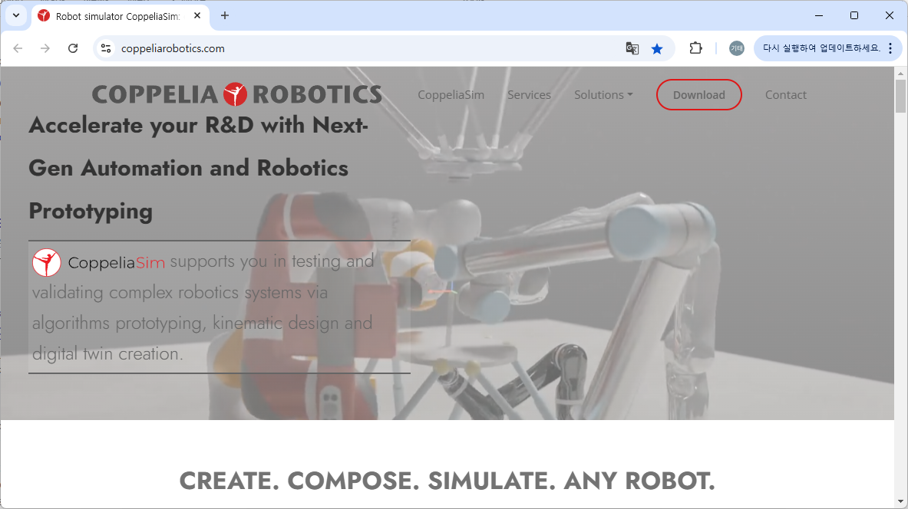
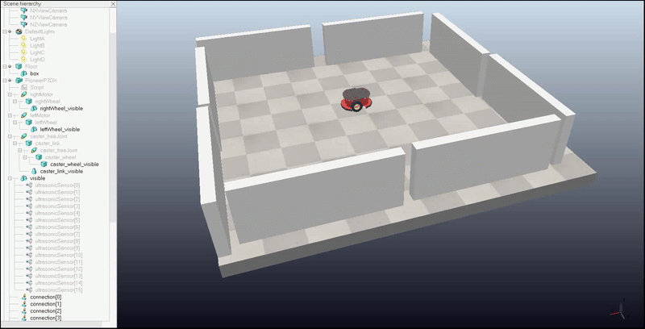
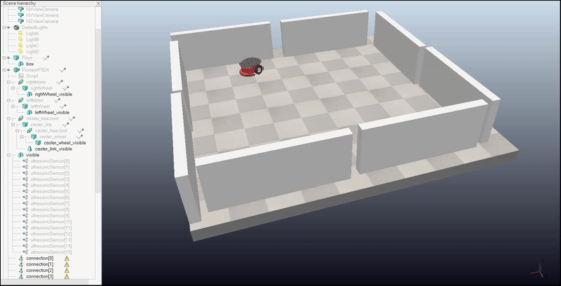
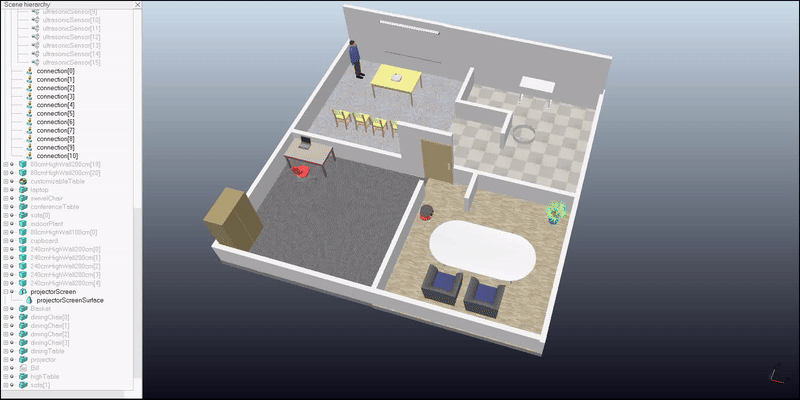

# Copelliasim 장애물 회피 알고리즘 구현

# 1장 개발 환경 구축 및 설정

## 1-1. **필수 소프트웨어 설치**

Coppliasim의 개발 및 실습 환경을 위해 Coppeliasim을 다운로드 받아 설치하고, 그 밖에 여러 Python 개발 환경을 위해 Python 설치, Visual Studio Code 설치, MiniConda 설치, 확장팩 설치, 가상환경 구축을 진행하겠습니다. MiniConda를 설치하면 별도의 파이썬 설치가 필요없으며, 또는 Visual Studio Code의 확장팩을 설치해도 별도의 파이썬 설치가 필요 없습니다. 여기에서는 세 가지 방법 모두 설명할 것이며, **필요에 따라 Python의 인터프리터(Interpreter)를 선택해서 실행하면 되겠습니다.**

### **(1) Coppeliasim 설치**

① CopelliaSim 공식 웹사이트([https://www.coppeliarobotics.com/](https://www.coppeliarobotics.com/))에서 다운로드 버튼을 눌러 다운로드를 진행합니다.




② 다운로드 받은 Coppeliasim_Edu_V4_x_x_rev2_Setup.exe 를 더블클릭하여 설치를 시작합니다.


③ 아래 그림과 같이 Copelliasim Edu를 설치 시작 화면이 로딩되면 [Next] 버튼을 누릅니다.


④ 라이선스 동의 화면이 나타나면 “YES - Accept the terms of the License Agreent!” 를 선택하고 [Next] 버튼을 누릅니다.


⑤ 프로그램 단축 아이콘 설정 화면이 로딩되면 [Next] 버튼을 누릅니다.


⑥ 셋업 설정 확인 화면이 로딩되면 [Next] 버튼을 누릅니다.


⑦ 아래 그림과 같이 설치를 진행합니다.


⑧ 설치가 모두 완료되면 설치 완료 화면이 로딩되고, 여기에서 [Finish] 버튼을 누르면, 컴퓨터가 다시 시작됩니다.


⑨ 컴퓨터가 재부팅되면 아래와 같이 Windows 시작 버튼을 누르고 Coppeliasim을 검색하여 실행합니다.


⑩ Coppeliasim Edu가 제대로 실행되었습니다.


### (2) 통합 개발 환경(IDE) 설치

1. **Python 설치**
    
    **Python 3.8 이상 버전 설치해야 합니다.**
    
    ① Python 공식 웹사이트([https://www.python.org/downloads/](https://www.python.org/downloads/))에서 Python 3.10 이상 버전을 다운로드 후 설치합니다. 현재는 Python 3.x.x 버전을 제공하고 있습니다.
    
    
    
    ② 아래 그림과 같이 python-3.x.x-amd64.exe 설치 파일을 더블 클릭하여 설치를 시작합니다.
    
    
    
    ③ 아래 그림과 같이 Python 설치 화면이 시작되면 "Add Python to PATH" 옵션을 활성화하고, [Install Now] 버튼을 클릭하여 설치를 진행합니다.
    
    
    
    ④ 설치 성공(Setup was successful) 화면이 로딩되면 설치가 모두 완료된 것입니다. [Close] 버튼을 눌러 설치를 종료합니다.
    
    
    
    ⑤ 명령 프롬프트를 실행하고 아래와 같이 “python --version” 명령어를 입력하여 Python의 설치를 확인합니다.
    
    
    
    ---
    
2. **코드 편집기 설치 (VS Code)**
    
    ① Visual Studio Code 다운로드 웹페이지(https://code.visualstudio.com/Download)에 방문하여 운영 체제에 맞는 설치 파일을 다운로드합니다.
    
    
    
    ② 다운로드(Downloads) 폴더로 이동하여 다운로드된 VSCodeUserSetup-x64-x.xx.x.exe 파일을 더블 클릭하여 프로그램의 설치를 시작합니다.
    
    
    
    ③ 사용권 계약 화면이 로딩되면 “동의합니다(A)”를 선택하고 [다음] 버튼을 클릭합니다.
    
    
    
    ④ 추가 작업 선택 화면이 로딩되면 “바탕화면에 바로가기 만들기(D)” 항목, “Code을(를) 지원되는 파일 형식에 대한 편집기로 등록합니다.” 항목, “PATH에 추가(다시 시작한 후 사용 가능)” 항목을 체크하여 선택한 후 [다음] 버튼을 눌러 설치를 진행합니다.
    
    
    
    ⑤ 설치 준비 완료 화면이 로딩되면 [설치] 버튼을 눌러 설치를 진행합니다.
    
    
    
    ⑥ 설치 완료 화면이 로딩되면 [종료] 버튼을 눌러 설치를 완료합니다. 설치가 완료되면 Visual Studio Code가 실행됩니다.
    
    
    
    ---
    
    1. **파이썬 미니콘다(MiniConda) 가상 환경 구축**
    
    ① 윈도우즈(Windows) 시작 > 명령 프롬프트(cmd: command)를 관리자 권한으로 실행합니다.
    
    
    
    ② 윈도우즈(Windows) 명령 프롬프트에서 다음 명령을 입력해 실행합니다.
    
    ```bash
    curl https://repo.anaconda.com/miniconda/Miniconda3-latest-Windows-x86_64.exe -o miniconda.exe
    start /wait "" .\miniconda.exe /S
    del miniconda.exe
    
    ```
    
    ---
    
    만약, 명령을 적기가 어려울 경우 먼저 언급한 Quick command line install 가이드 페이지에서 Copy to clipboard 아이콘 버튼을 눌러 붙여넣기합니다.
    
    
    
    ③ 윈도우즈(Windows) 시작 > Miniconda3 (64-bit) > Anaconda Prompt를 실행합니다.
    
    
    
    ④ 패키지 다운로드를 위한 conda-forge 레포시터리 채널을 추가하고, 채널 우선 순위를 변경합니다.
    
    ```bash
    **conda config --add channels conda-forge && conda config --set channel_priority strict**
    ```
    
    ⑤ Anaconda Prompt (miniconda)창을 닫습니다.
    
    ---
    
    1. **Visual Studio Code 확장팩 설치**
    
    ① Visual Studio Code에서 왼쪽 툴바의 5번째 Extensions 아이콘을 누르거나 [Ctrl]+[Shift]+[X]을 선택하면 확장 탭이 열립니다.
    
    
    
    ② “Korean Language Pack”를 검색하여 Korean Language Pack for Visual Studio Code 확장팩의 [Install] 버튼을 눌러 설치하면, 재시작 창이 뜨고 그 창에서 재실행(Restart) 버튼을 누르면 visual studio code를 재실행합니다.
    
    
    
    ③ “Python Extension Pack”를 검색하여 [설치] 버튼을 눌러 Python 확장팩을 설치합니다.
    
    
    
    ④ “Jupyter”을 검색하여 [설치] 버튼을 눌러 Jupyter 확장팩을 설치합니다.
    
    
    
    ---
    
    1. **Visual Studio Code 파이썬 가상환경 생성 및 가져오기**
    
    ① 새로운 Visual Studio Code를 실행하고 [파일]-[폴더 열기] 메뉴를 선택하여 작업 디렉터리인 "fullstack” 디렉터리를 엽니다.
    
    
    
    ② [보기]-[명령 팔레트…] 메뉴 또는 단축키 [Ctrl]+[Shift]+[P]를 눌러 명령 팔레트를 열고 아래 그림과 같이 “Python: Select Interpreter”를 입력한 후 나오는 메뉴에서 “Python: 인터프리터 선택”을 선택하고 [Enter] 키를 누릅니다.
    
    
    
    ③ 인터프리터 선택 메뉴가 열리면 해당 목록에서 먼저 설치된 “Python 3.x.x”을 선택하되 “글로벌”이라는 표시가 되어 있는 것을 선택하고 [Enter] 키를 누릅니다.
    
    
    
    ④ [터미널]-[새 터미널] 메뉴를 선택하거나 단축키 [Ctrl]+[J] 키를 눌러 터미널을 엽니다.
    
    
    
    ⑤ 기본 터미널을 설정을 위해서는 나타난 터미널에서 오른쪽의 툴바에서 아래 왼쪽 그림과 같이 [시작 프로필…] 버튼을 눌러 나오는 메뉴에서 “기본 프로필 선택” 메뉴를 선택하고, 오른쪽 그림과 같이 상단에 명령 팔레트가 펼쳐지면 “Command Prompt C:\Windows/System32\cmd.exe”를 선택하고 [Enter] 키를 누릅니다.
    (단, 기본 터미널 설정이란 터미널을 실행할 때 기본적으로 실행될 터미널을 의미하며 기본 터미널 설정은 한 번만 설정하면 됩니다.)
    
       
    
    
    
    
    
    ⑥ 기본 터미널 설정이 완료되면 휴지통 모양의 [터미널 종료] 버튼을 누르고 다시 터미널을 엽니다.
    
    
    
    ⑦ [터미널]-[새 터미널] 메뉴를 선택하거나 단축키 [Ctrl]+[J] 키를 눌러 터미널을 엽니다.
    
    
    
    ⑧ 터미널에서 프로젝트별 독립적인 Python 환경을 관리하고 실행하기 위한 가상 환경(venv)을 생성합니다. fullstack 디렉터리 안에 한 번만 가상 환경을 생성하면 되며, 매 번 Python 실습 시에는 가상 환경(venv) 활성화를 진행하고 하위 디렉터리로 이동합니다.
    
    ```bash
    python -m venv .venv
    ```
    
    ⑨ 터미널에서 생성된 가상 환경(venv)를 활성화합니다.
    
    ```bash
    .\.venv\Scripts\activate
    ```
    
    ---
    
    **위 정식 Python 설치, MiniConda 설치, Visual Studio Code의 확장팩 설치 등의 세 가지 방법 중에서 본인이 원하는 방법 하나만 하셔도 Python 가상 환경을 활용할 수 있습니다.  인터프리터 선택 메뉴에서 설치한 Python은 오른쪽에 글로벌로 표시되며, MiniConda로 설치된 Python은 오른쪽에 Conda로 표시되고, Visual Studio Code 확장팩으로 설치된 것은 base 또는 맞춤으로 표시되니 원하는 것을 선택하셔서 사용하시기 바랍니다.**
    

---

## 1-2. **라이브러리 설치**

CopelliaSim과 Python 간의 Remote API 통신을 위해 아래의 Python 라이브러리를 설치합니다:

```bash
# pip install coppeliasimpy numpy
pip install numpy msgpack-rpc-python
```


---

## 1-3. **CopelliaSim 설정**

1. **시뮬레이션 환경 구성**
- CopelliaSim 로봇 모델을 로드합니다.
    - `Model Browser`에서 robots > mobile > PioneerP3DX를 선택하거나 드래그하여 추가
    
    
    
- **센서 확인**
    - 자동차에 센서(Proximity Sensors)가 부착되어 있는지 확인합니다.
    - 총 16개의 센서를 확인


- **센서 이름** 설정
    - 각각의 센서에 이름 부여 (예: `sensor_1`, `sensor_2` 등)

- **벽체** 추가
    - `Model Browser`에서 infrastructure > walls > 80cm high walls > wall section 200cm를 선택 및 드래그하여 아래 그림과 같이 추가
    
    
    

- **시뮬레이션** 시작
    - 상단 툴바에서  [Start/resume simulation] 버튼을 눌러 작동을 시킵니다.
    
    
    



<br>



<br>



<br>

### **프로젝트 저장**

- 시뮬레이션 환경을 구성한 후 파일을 저장합니다. (basic02.ttt)
    - File > Save Scene 메뉴를 선택하여 아래 그림과 같이 basic02.ttt를 입력하고 [저장] 버튼을 눌러 저장합니다.
    
    
    

### RemoteAPI 설정

- C:\Program Files\CoppeliaRobotics\CoppeliaSimEdu\remoteApiConnections.txt 파일을 Visual Studio Code로 열고 아래와 같이 수정합니다.

```
portIndex1_port = 19997
portIndex1_debug = true
portIndex1_syncSimTrigger = true

portIndex2_port = 19998
portIndex2_debug = false
portIndex2_syncSimTrigger = false

portIndex3_port = 19999
portIndex3_debug = false
portIndex3_syncSimTrigger = false

useVrepHandles = true
```

- Coppeliasim을 종료하였다가 재기동합니다.

---

# 2장 장애물 알고리즘 구현

## 2-1. 알고리즘 프로세스

1. CopelliaSim의 자동차와 센서에 접근하기 위한 핸들 가져오기
2. 센서 값을 읽어 장애물을 감지하고 회피하도록 로직 구현
3. 자동차의 모터 속도를 제어하여 장애물을 피하도록 동작

---

## 2-2. 기본 장애물 회피 (임계값 기반 회피)

기본 장애물 회피는 CopelliaSim에서 자동차를 제어하여 장애물을 감지하고 회피하는 기능을 수행합니다.

### (1) 기본 장애물 회피 프로세스

- 자동차가 센서를 사용하여 장애물의 거리를 측정합니다.
- 가장 가까운 장애물이 임계값(예: 0.5m) 이내에 있으면 회피 동작을 수행합니다.
- 단순한 로직으로, 직진 또는 한쪽 방향으로만 회피합니다.

### (2) 기본 장애물 회피 구현

**copelliasim/basic_avoidance.py**

```python
import sim
import time

# CopelliaSim 서버 연결 함수
def connect_to_sim():
    sim.simxFinish(-1)  # 이전 연결 초기화
    client_id = sim.simxStart('127.0.0.1', 19997, True, True, 5000, 5)  # 서버 연결
    if client_id == -1:
        print("Failed to connect to CopelliaSim.")
        return None
    print("Connected to CopelliaSim.")
    return client_id

# 센서 값 읽기 함수
def get_sensor_data(client_id, sensor_handles):
    distances = []
    for handle in sensor_handles:
        # 센서 값 읽기
        _, detection_state, detected_point, _, _ = sim.simxReadProximitySensor(client_id, handle, sim.simx_opmode_buffer)
        if detection_state:  # 장애물 감지 시
            distances.append(detected_point[2])  # 감지된 거리 (z축 값)
        else:
            distances.append(float('inf'))  # 감지 실패 시 큰 값 반환
    return distances

# 장애물 회피 로직
def simple_obstacle_avoidance(client_id, motor_handles, sensor_handles):
    left_motor, right_motor = motor_handles
    while True:
        distances = get_sensor_data(client_id, sensor_handles)  # 센서 데이터 읽기
        min_distance = min(distances)  # 가장 가까운 장애물 거리 확인
        print(f"Sensor readings: {distances}")

        if min_distance < 0.5:  # 장애물이 임계값(0.5m) 이내에 있을 경우
            print("Obstacle detected! Turning right.")
            # 오른쪽으로 회전
            sim.simxSetJointTargetVelocity(client_id, left_motor, 2.0, sim.simx_opmode_streaming)
            sim.simxSetJointTargetVelocity(client_id, right_motor, -2.0, sim.simx_opmode_streaming)
        else:  # 장애물이 없으면 직진
            sim.simxSetJointTargetVelocity(client_id, left_motor, 2.0, sim.simx_opmode_streaming)
            sim.simxSetJointTargetVelocity(client_id, right_motor, 2.0, sim.simx_opmode_streaming)

        time.sleep(0.1)  # 0.1초 간격으로 반복

# 메인 함수
if __name__ == "__main__":
    # CopelliaSim 연결
    client_id = connect_to_sim()
    if client_id:
        # 자동차 모터 핸들 가져오기
        _, left_motor = sim.simxGetObjectHandle(client_id, 'left_motor', sim.simx_opmode_blocking)
        _, right_motor = sim.simxGetObjectHandle(client_id, 'right_motor', sim.simx_opmode_blocking)

        # 센서 핸들 가져오기
        sensor_handles = []
        for i in range(1, 5):  # sensor_1, sensor_2, sensor_3, sensor_4
            _, sensor_handle = sim.simxGetObjectHandle(client_id, f'sensor_{i}', sim.simx_opmode_blocking)
            sensor_handles.append(sensor_handle)

        # 센서 스트리밍 초기화
        for sensor in sensor_handles:
            sim.simxReadProximitySensor(client_id, sensor, sim.simx_opmode_streaming)

        # 장애물 회피 실행
        try:
            simple_obstacle_avoidance(client_id, (left_motor, right_motor), sensor_handles)
        except KeyboardInterrupt:
            print("Stopping the simulation.")
            sim.simxFinish(client_id)  # 연결 종료
```

---

- **환경 설정**
    - CopelliaSim에서 자동차 모터 이름(`left_motor`, `right_motor`)과 센서 이름(`sensor_1`, `sensor_2`, ...)을 반드시 확인하고 일치시켜야 합니다.
- **센서 데이터 처리**
    - 센서가 장애물을 감지하지 못하면 무한대 값(`inf`)을 반환하여 안전한 주행을 보장합니다.
- **임계값 설정**
    - 장애물을 회피하는 기준 거리(`0.5m`)는 필요에 따라 조정할 수 있습니다.
- **속도 설정**
    - 왼쪽과 오른쪽 모터의 속도를 조정하여 장애물을 회피합니다.
- **중단 처리**
    - `Ctrl+C`를 통해 프로그램을 중단하면 CopelliaSim 연결이 종료됩니다.

### (3) 기본 장애물 회피 코드 실행

1. **CopelliaSim 환경 설정**
    - 자동차 모터 이름(`left_motor`, `right_motor`)과 센서 이름(`sensor_1`, `sensor_2`, ...)이 정확히 매칭되어야 합니다.
2. **코드 실행**
    - 위 코드를 Python 파일로 저장 후 실행
        
        ```bash
        python basic_avoidance.py
        ```
        

## 2-2. **센서 우선순위 기반 장애물 회피**

**센서 우선순위 기반 회피** 방법은 센서 데이터를 기반으로 장애물의 방향을 감지하고, 장애물의 위치에 따라 회피 방향을 결정합니다.

### (1) 센서 우선순위 기반 장애물 회피 프로세스

- 여러 개의 센서를 사용하며, 특정 센서가 감지한 거리와 방향에 따라 회피 방향을 결정합니다.
- 장애물이 감지된 센서의 위치에 따라 좌회전 또는 우회전을 수행합니다.
- 센서 데이터를 비교하여 우선순위를 설정합니다.

### (2) 센서 우선순위 기반 장애물 회피 구현

**copelliasim/priority_avoidance.py**

```python
import sim
import time

# CopelliaSim 서버 연결 함수
def connect_to_sim():
    sim.simxFinish(-1)  # 이전 연결 초기화
    client_id = sim.simxStart('127.0.0.1', 19997, True, True, 5000, 5)  # 서버 연결
    if client_id == -1:
        print("Failed to connect to CopelliaSim.")
        return None
    print("Connected to CopelliaSim.")
    return client_id

# 센서 값 읽기 함수
def get_sensor_data(client_id, sensor_handles):
    distances = []
    for handle in sensor_handles:
        # 센서 값 읽기
        _, detection_state, detected_point, _, _ = sim.simxReadProximitySensor(client_id, handle, sim.simx_opmode_buffer)
        if detection_state:  # 장애물 감지 시
            distances.append(detected_point[2])  # 감지된 거리 (z축 값)
        else:
            distances.append(float('inf'))  # 감지 실패 시 큰 값 반환
    return distances

# 센서 우선순위 기반 회피 로직
def priority_based_avoidance(client_id, motor_handles, sensor_handles):
    left_motor, right_motor = motor_handles
    while True:
        distances = get_sensor_data(client_id, sensor_handles)  # 센서 데이터 읽기

        # 센서 데이터 매핑 (예: 왼쪽 앞/오른쪽 앞)
        left_distance = distances[0]  # 좌측 센서
        right_distance = distances[1]  # 우측 센서

        print(f"Sensor readings: {distances}")

        if left_distance < 0.5:  # 왼쪽에 장애물
            print("Obstacle detected on the left! Turning right.")
            sim.simxSetJointTargetVelocity(client_id, left_motor, 2.0, sim.simx_opmode_streaming)  # 오른쪽 회전
            sim.simxSetJointTargetVelocity(client_id, right_motor, 0.5, sim.simx_opmode_streaming)
        elif right_distance < 0.5:  # 오른쪽에 장애물
            print("Obstacle detected on the right! Turning left.")
            sim.simxSetJointTargetVelocity(client_id, left_motor, 0.5, sim.simx_opmode_streaming)  # 왼쪽 회전
            sim.simxSetJointTargetVelocity(client_id, right_motor, 2.0, sim.simx_opmode_streaming)
        else:  # 장애물이 없으면 직진
            sim.simxSetJointTargetVelocity(client_id, left_motor, 2.0, sim.simx_opmode_streaming)
            sim.simxSetJointTargetVelocity(client_id, right_motor, 2.0, sim.simx_opmode_streaming)

        time.sleep(0.1)  # 0.1초 간격으로 반복

# 메인 함수
if __name__ == "__main__":
    # CopelliaSim 연결
    client_id = connect_to_sim()
    if client_id:
        # 자동차 모터 핸들 가져오기
        _, left_motor = sim.simxGetObjectHandle(client_id, 'left_motor', sim.simx_opmode_blocking)
        _, right_motor = sim.simxGetObjectHandle(client_id, 'right_motor', sim.simx_opmode_blocking)

        # 센서 핸들 가져오기
        sensor_handles = []
        for i in range(1, 5):  # sensor_1, sensor_2, sensor_3, sensor_4
            _, sensor_handle = sim.simxGetObjectHandle(client_id, f'sensor_{i}', sim.simx_opmode_blocking)
            sensor_handles.append(sensor_handle)

        # 센서 스트리밍 초기화
        for sensor in sensor_handles:
            sim.simxReadProximitySensor(client_id, sensor, sim.simx_opmode_streaming)

        # 장애물 회피 실행
        try:
            priority_based_avoidance(client_id, (left_motor, right_motor), sensor_handles)
        except KeyboardInterrupt:
            print("Stopping the simulation.")
            sim.simxFinish(client_id)  # 연결 종료

```

- **센서 데이터 매핑**
    - `sensor_handles`의 첫 번째와 두 번째 값을 각각 왼쪽 및 오른쪽 센서로 매핑합니다.
    - 각 센서로부터 감지된 거리 데이터를 기반으로 장애물의 위치를 확인합니다.
- **우선순위에 따른 회피**
    - **왼쪽에 장애물이 감지**된 경우: 자동차가 오른쪽으로 회전합니다.
    - **오른쪽에 장애물이 감지**된 경우: 자동차가 왼쪽으로 회전합니다.
    - **장애물이 없는 경우**: 직진.
- **임계값 기반 동작**
    - 장애물이 0.5m 이내에 들어오면 회피 동작을 수행합니다.
    - 이 값은 필요에 따라 조정할 수 있습니다.
- **속도 제어**
    - 좌/우 모터의 속도를 개별적으로 설정하여 회피 방향을 결정합니다.

### (3) 센서 우선 순위 기반 코드 실행

1. **CopelliaSim 환경 설정**
    - 자동차 모터 이름(`left_motor`, `right_motor`)과 센서 이름(`sensor_1`, `sensor_2`, ...)이 정확히 매칭되어야 합니다.
2. **코드 실행**
    - 위 코드를 Python 파일로 저장 후 실행:
        
        ```bash
        python priority_avoidance.py
        ```
        

### (4) 센서 우선 순위 기반 코드 실행 결과

- 장애물의 위치에 따라 자동차가 유동적으로 좌회전/우회전을 하며 장애물을 회피합니다.
- 자동차가 장애물 사이를 빠르게 통과할 수 있는 동작을 관찰할 수 있습니다.

## 2-3. **P-controller 기반 장애물 회피**

**P-controller 기반 장애물 회피** 방법은 Proportional Controller(P-제어기)를 사용하여 센서 데이터를 바탕으로 자동차의 속도를 동적으로 조정하며 장애물을 회피합니다.

### (1) P-controller 기반 장애물 회피 프로세스

- 센서 데이터를 입력으로 받아 PID 제어기(단순히 P 제어기를 사용)로 속도를 조정합니다.
- 장애물까지의 거리와 임계값 간의 차이를 사용하여 각 바퀴의 속도를 동적으로 조정합니다.
- 장애물의 위치와 거리에 따라 유연하게 회피 경로를 생성합니다.

### (2) P-controller 기반 장애물 회피 구현

**copelliasim/pcontroller_avoidance.py**

```python
import sim
import time

# CopelliaSim 서버 연결 함수
def connect_to_sim():
    sim.simxFinish(-1)  # 이전 연결 초기화
    client_id = sim.simxStart('127.0.0.1', 19997, True, True, 5000, 5)  # 서버 연결
    if client_id == -1:
        print("Failed to connect to CopelliaSim.")
        return None
    print("Connected to CopelliaSim.")
    return client_id

# 센서 값 읽기 함수
def get_sensor_data(client_id, sensor_handles):
    distances = []
    for handle in sensor_handles:
        # 센서 값 읽기
        _, detection_state, detected_point, _, _ = sim.simxReadProximitySensor(client_id, handle, sim.simx_opmode_buffer)
        if detection_state:  # 장애물 감지 시
            distances.append(detected_point[2])  # 감지된 거리 (z축 값)
        else:
            distances.append(float('inf'))  # 감지 실패 시 큰 값 반환
    return distances

# P-controller 기반 장애물 회피 로직
def p_controller_avoidance(client_id, motor_handles, sensor_handles, kp=1.5):
    left_motor, right_motor = motor_handles
    while True:
        distances = get_sensor_data(client_id, sensor_handles)  # 센서 데이터 읽기

        # 센서 데이터 매핑 (예: 왼쪽 앞/오른쪽 앞)
        left_distance = distances[0]  # 좌측 센서
        right_distance = distances[1]  # 우측 센서

        # 에러 계산 (장애물 거리와 임계값의 차이)
        left_error = 0.5 - left_distance if left_distance < 0.5 else 0
        right_error = 0.5 - right_distance if right_distance < 0.5 else 0

        # P 제어값 계산
        left_speed = 2.0 + kp * right_error  # 왼쪽 모터 속도
        right_speed = 2.0 + kp * left_error  # 오른쪽 모터 속도

        # 속도 제한 (최대/최소 속도 설정)
        left_speed = max(-2.0, min(2.0, left_speed))
        right_speed = max(-2.0, min(2.0, right_speed))

        # 속도 설정
        sim.simxSetJointTargetVelocity(client_id, left_motor, left_speed, sim.simx_opmode_streaming)
        sim.simxSetJointTargetVelocity(client_id, right_motor, right_speed, sim.simx_opmode_streaming)

        print(f"Left Speed: {left_speed:.2f}, Right Speed: {right_speed:.2f}")
        time.sleep(0.1)  # 0.1초 간격으로 반복

# 메인 함수
if __name__ == "__main__":
    # CopelliaSim 연결
    client_id = connect_to_sim()
    if client_id:
        # 자동차 모터 핸들 가져오기
        _, left_motor = sim.simxGetObjectHandle(client_id, 'left_motor', sim.simx_opmode_blocking)
        _, right_motor = sim.simxGetObjectHandle(client_id, 'right_motor', sim.simx_opmode_blocking)

        # 센서 핸들 가져오기
        sensor_handles = []
        for i in range(1, 5):  # sensor_1, sensor_2, sensor_3, sensor_4
            _, sensor_handle = sim.simxGetObjectHandle(client_id, f'sensor_{i}', sim.simx_opmode_blocking)
            sensor_handles.append(sensor_handle)

        # 센서 스트리밍 초기화
        for sensor in sensor_handles:
            sim.simxReadProximitySensor(client_id, sensor, sim.simx_opmode_streaming)

        # P-controller 기반 장애물 회피 실행
        try:
            p_controller_avoidance(client_id, (left_motor, right_motor), sensor_handles)
        except KeyboardInterrupt:
            print("Stopping the simulation.")
            sim.simxFinish(client_id)  # 연결 종료

```

- **센서 데이터 매핑**
    - `sensor_handles`의 첫 번째와 두 번째 값을 각각 왼쪽 및 오른쪽 센서로 매핑합니다.
    - 거리 데이터를 읽고, 장애물 감지 여부와 거리를 확인합니다.
- **P-controller를 이용한 속도 조정**
    - **에러 계산**: 장애물 거리(`0.5m`)와 감지된 거리 간의 차이로 에러를 계산합니다.
    - **제어 신호 계산**: 에러에 비례하여 속도 값을 조정합니다. `kp` 값(비례 상수)은 조정 가능하며, 회피 움직임의 민감도를 결정합니다.
    - 왼쪽과 오른쪽 모터의 속도를 개별적으로 설정하여 회피 방향을 제어합니다.
- **속도 제한**
    - 계산된 속도는 자동차의 물리적 한계를 벗어나지 않도록 `2.0`에서 `2.0` 사이로 제한합니다.
- **장애물 회피 동작**
    - **왼쪽에 장애물**: 오른쪽 모터 속도를 증가시켜 우회전.
    - **오른쪽에 장애물**: 왼쪽 모터 속도를 증가시켜 좌회전.
    - **장애물이 없는 경우**: 양쪽 모터의 속도를 동일하게 설정하여 직진

### (3) P-controller 기반 장애물 회피 코드 실행

- **CopelliaSim 환경 설정**
    - 자동차의 모터 이름(`left_motor`, `right_motor`)과 센서 이름(`sensor_1`, `sensor_2`, ...)이 Python 코드와 일치해야 합니다.
- **코드 실행**
    - 위 코드를 Python 파일로 저장 후 실행
        
        ```bash
        python p_controller_avoidance.py
        ```
        

### (4) P-controller 기반 장애물 회피 실행 결과

- 자동차가 장애물의 위치와 거리 데이터를 기반으로 회피 동작을 수행합니다.
- P-controller를 통해 부드럽고 자연스러운 회피 움직임을 관찰할 수 있습니다.

# 3장 기타 장애물 회피

기본 장애물 회피, 센서 우선순위 기반 회피, P-controller 기반 회피 외에도 여러 회피 알고리즘이 있습니다. 그러한 회피 알고리즘에는 랜덤 회피(Random Avoidance), PID Controller 기반 회피,  다중 센서 통합 회피 (Weighted Average) 등이 있습니다.

- **랜덤 회피(Random Avoidance)**
- **PID Controller 기반 회피**
- **다중 센서 통합 회피 (Weighted Average)**

## 3-1. 랜덤 회피(Random Avoidance)

이 알고리즘은 센서가 장애물을 감지하면 임의로 방향을 정해 회피하는 방법입니다. 랜덤성을 추가하여 로봇이 예측 불가능한 방식으로 움직이게 할 수 있습니다.

**copelliasim/random_avoidance.py**

```python
import sim
import time
import random

# CopelliaSim 서버 연결 함수
def connect_to_sim():
    sim.simxFinish(-1)
    client_id = sim.simxStart('127.0.0.1', 19997, True, True, 5000, 5)
    if client_id == -1:
        print("Failed to connect to CopelliaSim.")
        return None
    print("Connected to CopelliaSim.")
    return client_id

# 센서 값 읽기 함수
def get_sensor_data(client_id, sensor_handles):
    distances = []
    for handle in sensor_handles:
        _, detection_state, detected_point, _, _ = sim.simxReadProximitySensor(client_id, handle, sim.simx_opmode_buffer)
        if detection_state:
            distances.append(detected_point[2])
        else:
            distances.append(float('inf'))
    return distances

# 랜덤 회피 로직
def random_avoidance(client_id, motor_handles, sensor_handles):
    left_motor, right_motor = motor_handles
    while True:
        distances = get_sensor_data(client_id, sensor_handles)
        min_distance = min(distances)

        if min_distance < 0.5:
            # 장애물이 감지되면 랜덤한 방향으로 회피
            direction = random.choice(['left', 'right'])
            if direction == 'left':
                sim.simxSetJointTargetVelocity(client_id, left_motor, 2.0, sim.simx_opmode_streaming)
                sim.simxSetJointTargetVelocity(client_id, right_motor, -2.0, sim.simx_opmode_streaming)
            else:
                sim.simxSetJointTargetVelocity(client_id, left_motor, -2.0, sim.simx_opmode_streaming)
                sim.simxSetJointTargetVelocity(client_id, right_motor, 2.0, sim.simx_opmode_streaming)
        else:
            sim.simxSetJointTargetVelocity(client_id, left_motor, 2.0, sim.simx_opmode_streaming)
            sim.simxSetJointTargetVelocity(client_id, right_motor, 2.0, sim.simx_opmode_streaming)

        time.sleep(0.1)

# 메인 함수
if __name__ == "__main__":
    client_id = connect_to_sim()
    if client_id:
        _, left_motor = sim.simxGetObjectHandle(client_id, 'left_motor', sim.simx_opmode_blocking)
        _, right_motor = sim.simxGetObjectHandle(client_id, 'right_motor', sim.simx_opmode_blocking)

        sensor_handles = []
        for i in range(1, 5):
            _, sensor_handle = sim.simxGetObjectHandle(client_id, f'sensor_{i}', sim.simx_opmode_blocking)
            sensor_handles.append(sensor_handle)

        for sensor in sensor_handles:
            sim.simxReadProximitySensor(client_id, sensor, sim.simx_opmode_streaming)

        try:
            random_avoidance(client_id, (left_motor, right_motor), sensor_handles)
        except KeyboardInterrupt:
            print("Stopping the simulation.")
            sim.simxFinish(client_id)

```

- **랜덤 회피**는 센서가 장애물을 감지할 때마다 `left` 또는 `right`로 임의로 회피합니다.
- 로봇이 장애물 앞에 가까워지면 빠르게 방향을 바꾸어 장애물을 피하려고 시도합니다.
- 회피 후 다시 직진 상태로 돌아갑니다.

## 3-2. PID Controller 기반 회피

PID 제어기를 사용하여 장애물 회피를 구현한 알고리즘입니다. PID 제어기는 Proportional, Integral, Derivative 요소를 통해 장애물과의 거리에 비례하여 더욱 세밀하게 제어할 수 있습니다.

**copelliasim/pic_avoidance.py**

```python
import sim
import time

# CopelliaSim 서버 연결 함수
def connect_to_sim():
    sim.simxFinish(-1)
    client_id = sim.simxStart('127.0.0.1', 19997, True, True, 5000, 5)
    if client_id == -1:
        print("Failed to connect to CopelliaSim.")
        return None
    print("Connected to CopelliaSim.")
    return client_id

# 센서 값 읽기 함수
def get_sensor_data(client_id, sensor_handles):
    distances = []
    for handle in sensor_handles:
        _, detection_state, detected_point, _, _ = sim.simxReadProximitySensor(client_id, handle, sim.simx_opmode_buffer)
        if detection_state:
            distances.append(detected_point[2])
        else:
            distances.append(float('inf'))
    return distances

# PID 기반 회피 로직
def pid_controller_avoidance(client_id, motor_handles, sensor_handles, kp=1.0, ki=0.0, kd=0.5):
    left_motor, right_motor = motor_handles
    prev_error = 0
    integral = 0

    while True:
        distances = get_sensor_data(client_id, sensor_handles)
        left_distance = distances[0]
        right_distance = distances[1]

        error = 0.5 - left_distance  # 왼쪽 센서 기준 에러 계산
        integral += error
        derivative = error - prev_error

        # PID 제어
        left_speed = 2.0 + kp * error + ki * integral + kd * derivative
        right_speed = 2.0 - kp * error - ki * integral - kd * derivative

        # 속도 제한
        left_speed = max(-2.0, min(2.0, left_speed))
        right_speed = max(-2.0, min(2.0, right_speed))

        sim.simxSetJointTargetVelocity(client_id, left_motor, left_speed, sim.simx_opmode_streaming)
        sim.simxSetJointTargetVelocity(client_id, right_motor, right_speed, sim.simx_opmode_streaming)

        prev_error = error
        time.sleep(0.1)

# 메인 함수
if __name__ == "__main__":
    client_id = connect_to_sim()
    if client_id:
        _, left_motor = sim.simxGetObjectHandle(client_id, 'left_motor', sim.simx_opmode_blocking)
        _, right_motor = sim.simxGetObjectHandle(client_id, 'right_motor', sim.simx_opmode_blocking)

        sensor_handles = []
        for i in range(1, 5):
            _, sensor_handle = sim.simxGetObjectHandle(client_id, f'sensor_{i}', sim.simx_opmode_blocking)
            sensor_handles.append(sensor_handle)

        for sensor in sensor_handles:
            sim.simxReadProximitySensor(client_id, sensor, sim.simx_opmode_streaming)

        try:
            pid_controller_avoidance(client_id, (left_motor, right_motor), sensor_handles)
        except KeyboardInterrupt:
            print("Stopping the simulation.")
            sim.simxFinish(client_id)

```

- **PID 제어기**는 장애물과의 거리를 기반으로 속도를 동적으로 조정하여 부드럽고 정확한 회피를 합니다.
- `kp`, `ki`, `kd` 값은 P, I, D 요소에 해당하며, 각각의 값을 조정하여 회피 동작을 최적화할 수 있습니다.

---

## 3-3. 다중 센서 통합 회피 (Weighted Average)

이 알고리즘은 여러 센서에서 받은 정보를 통합하여 장애물 회피를 하는 방법입니다. 각 센서에 가중치를 두고, 센서들로부터 받은 정보를 평균을 내어 회피 방향을 결정합니다.

**copelliasim/weight_avoidance.py**

```python
import sim
import time

# CopelliaSim 서버 연결 함수
def connect_to_sim():
    sim.simxFinish(-1)
    client_id = sim.simxStart('127.0.0.1', 19997, True, True, 5000, 5)
    if client_id == -1:
        print("Failed to connect to CopelliaSim.")
        return None
    print("Connected to CopelliaSim.")
    return client_id

# 센서 값 읽기 함수
def get_sensor_data(client_id, sensor_handles):
    distances = []
    for handle in sensor_handles:
        _, detection_state, detected_point, _, _ = sim.simxReadProximitySensor(client_id, handle, sim.simx_opmode_buffer)
        if detection_state:
            distances.append(detected_point[2])
        else:
            distances.append(float('inf'))
    return distances

# 다중 센서 통합 회피 로직
def weighted_average_avoidance(client_id, motor_handles, sensor_handles):
    left_motor, right_motor = motor_handles
    while True:
        distances = get_sensor_data(client_id, sensor_handles)

        # 각 센서에 대한 가중치 부여
        weights = [0.2, 0.3, 0.3, 0.2]  # 센서1, 센서2, 센서3, 센서4에 대한 가중치
        weighted_left_distance = sum([distances[i] * weights[i] for i in range(4)])

        # 회피 결정
        if weighted_left_distance < 0.5:
            sim.simxSetJointTargetVelocity(client_id, left_motor, -2.0, sim.simx_opmode_streaming)
            sim.simxSetJointTargetVelocity(client_id, right_motor, 2.0, sim.simx_opmode_streaming)
        else:
            sim.simxSetJointTargetVelocity(client_id, left_motor, 2.0, sim.simx_opmode_streaming)
            sim.simxSetJointTargetVelocity(client_id, right_motor, 2.0, sim.simx_opmode_streaming)

        time.sleep(0.1)

# 메인 함수
if __name__ == "__main__":
    client_id = connect_to_sim()
    if client_id:
        _, left_motor = sim.simxGetObjectHandle(client_id, 'left_motor', sim.simx_opmode_blocking)
        _, right_motor = sim.simxGetObjectHandle(client_id, 'right_motor', sim.simx_opmode_blocking)

        sensor_handles = []
        for i in range(1, 5):
            _, sensor_handle = sim.simxGetObjectHandle(client_id, f'sensor_{i}', sim.simx_opmode_blocking)
            sensor_handles.append(sensor_handle)

        for sensor in sensor_handles:
            sim.simxReadProximitySensor(client_id, sensor, sim.simx_opmode_streaming)

        try:
            weighted_average_avoidance(client_id, (left_motor, right_motor), sensor_handles)
        except KeyboardInterrupt:
            print("Stopping the simulation.")
            sim.simxFinish(client_id)
```

- **다중 센서 통합**에서는 각 센서에 대해 가중치를 두어 정보를 통합하고, 그 값에 따라 회피 동작을 결정합니다.
- 센서들의 가중치를 변경하여 장애물 회피 전략을 미세 조정할 수 있습니다.